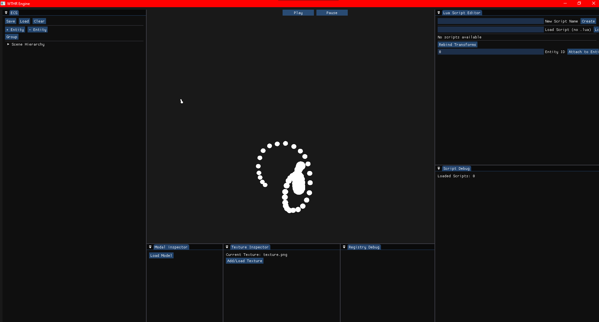

# 🛠️ Game Engine

A personal hobby project exploring C++ engine development. This is a sandbox for learning about data-oriented design, ECS architectures, and integrating Lua scripting for flexible gameplay logic.

---

## 📸 Previews

<p align="center">
  
  
</p>

---

## ✨ Features

* **ECS Architecture:** Built using `EnTT` for a decoupled, data-oriented approach to entities and components.
* **Async Model Loading:** Implemented a multi-threaded loader using a second shared OpenGL context to upload textures and meshes without stalling the main render thread.
* **Scripting Engine:** `Lua` integration via `sol2`, allowing for real-time logic updates without recompiling C++.
* **Editor Tooling:** Real-time entity manipulation using `ImGuizmo` and property inspection via `ImGui`.
* **Unit Testing:** Core math and system logic verified through the `Catch2` framework to ensure stability.

---

## 🛠 Tech Stack

| Component | Technology |
| :--- | :--- |
| **Language** | C++17 / C++20 |
| **Graphics API** | OpenGL (Shared Context for Async) |
| **ECS** | EnTT |
| **Scripting** | Lua / sol2 |
| **Editor UI** | ImGui / ImGuizmo |
| **Testing** | Catch2 |
| **Build System** | CMake |

---

## 🚀 Getting Started

### Prerequisites

1. **Visual Studio 2022** (MSVC Compiler).
2. **CMake**: For project generation.
3. **Dependencies**: Ensure submodules are initialized if libraries aren't installed globally.

### Installation & Build

1. **Clone the repository (including submodules):**
   ```bash
   git clone --recursive [https://github.com/Wither312/Engine.git](https://github.com/Wither312/Engine.git)
   cd Engine